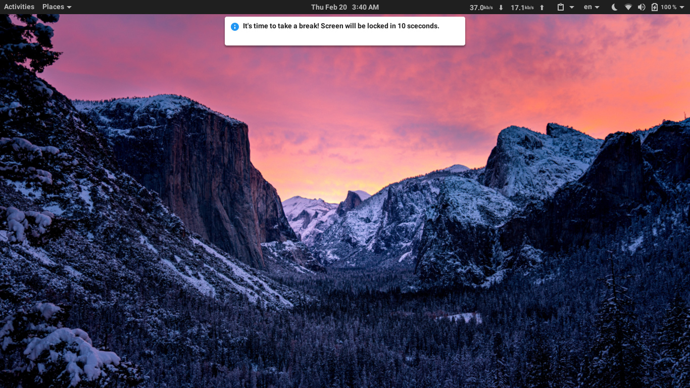
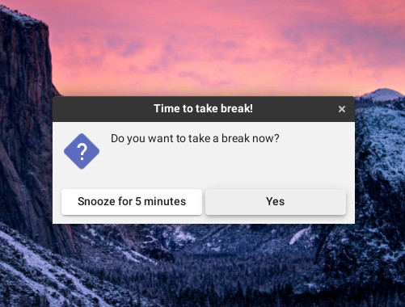

# Break Timer For Linux
A simple python application that reminds you to take break after certain amount of screen on time and automatically lock the screen. You can also enable an optional snooze option. 

Timer will reset itself when the screen gets locked and start again at the next unlock. 

The app will show the following notification before locking the screen.



If you enalble snooze option you will get a prompt to take a break or snooze it for few minutes. Snooze time can be configured in startup.



## Installation

This python app depends linux desktop screen saver packages like `gnome-screensaver-command` or `cinnamon-screensaver-command`. Also uses `send-notify` pacage to show notification. First make sure that you have this packages installed in your linux desktop.

Then clone git repository and cd into directory

```
git clone https://github.com/saifulislamplabon/break-timer-for-linux.git
cd break-timer-for-linux
```

## Usage

### Running as a Python Script

Run the `break-timer.py` with desired otptions. For example to set a break for every 20 minutes, run -

```
python3 break-timer.py -t 20
```

To enable snooze option -

```
python3 break-timer.py -t 20 -s true
```

To run this program in background add `nohup` at the begining -

```
nohup python3 break-timer.py -t 20 &
```

Alternatively see distro specific documentation for how to run a python program on startup.

Other available options are given here -

```
-h, --help          Show Help Options
-d, --desktop       Name of the desktop environment (e.g: "gnome", "cinnamon", default "gnome")
-t, --active-time   Time in minutes before the app shows screen lock notification after unlock (default 20)
-p, --grace-period  Time in seconds before the screen get locked after showing notification (default 10)
-s, --snooze-enable Enable snooze option (default false)
-z, --snooze-time   Snooze time in minutes (default 5)
```

Timer can also be configured via environment variable. Open .bashrc or .zshrc and add the following lines
with desired changes -

```
export BREAK_TIMER_MAX_ACTIVE_MIN=30
export BREAK_TIMER_GRACE_SEC=10
export BREAK_TIMER_SNOOZE_ENABLED=false
export BREAK_TIMER_SNOOZE_TIME_MIN=5
```

## Credits


Icon used in notification is made by [ultimatearm](https://www.flaticon.com/authors/ultimatearm) from [www.flaticon.com]("https://www.flaticon.com")
